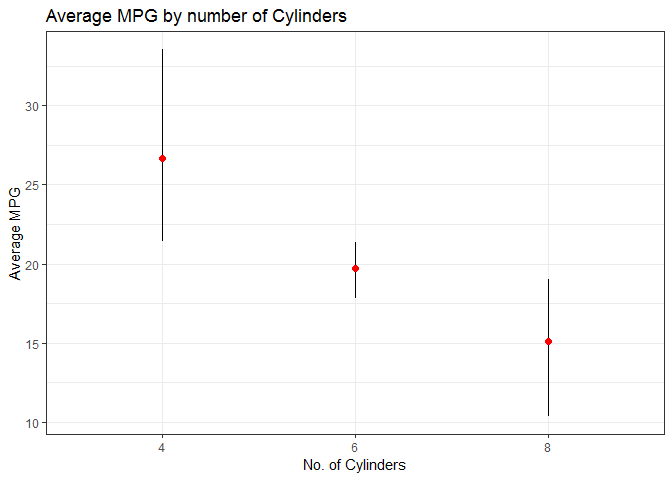

<!-- README.md is generated from README.Rmd. Please edit that file -->
tabletools
==========

The goal of tabletools is to provide functions which are helpful for generating summary html tables. For details on the functions, please see help documentation in the package.

Installation
------------

Install from Github: `devtools::install_github("JMLuther/tabletools")`

These functions are most useful in conjunction with an html table generating package::functions such as:

-   `htmlTable::htmlTable` [Tables with htmlTable and some alternatives](https://cran.r-project.org/web/packages/htmlTable/vignettes/tables.html)
-   `knitr::kable` see [Create Awesome HTML Table with knitr::kable and kableExtra](https://haozhu233.github.io/kableExtra/awesome_table_in_html.html)
-   `formattable`

`my_summary` custom summary
---------------------------

This summary function is customized to my preferences, and should provide enough data to pipe into ggplot or a simple summary table. Just provides a summary for a single continuous variable.

Table:

``` r
mtcars %>% 
  group_by(cyl) %>% 
  my_summary(mpg, digits = 1) %>% # override the default 2 decimal point rounding
  htmlTable::htmlTable(rnames=F, align = "c",
                       css.cell = rbind(rep("padding-left: .5em; padding-right: .5em;",times=ncol(.)),
                                        matrix("padding:0 5px 0 5px;", ncol=ncol(.), nrow=nrow(.))))
```

<table class="gmisc_table" style="border-collapse: collapse; margin-top: 1em; margin-bottom: 1em;">
<thead>
<tr>
<th style="padding-left: .5em; padding-right: .5em; border-bottom: 1px solid grey; border-top: 2px solid grey; text-align: center;">
cyl
</th>
<th style="padding-left: .5em; padding-right: .5em; border-bottom: 1px solid grey; border-top: 2px solid grey; text-align: center;">
mpg\_mean
</th>
<th style="padding-left: .5em; padding-right: .5em; border-bottom: 1px solid grey; border-top: 2px solid grey; text-align: center;">
mpg\_sd
</th>
<th style="padding-left: .5em; padding-right: .5em; border-bottom: 1px solid grey; border-top: 2px solid grey; text-align: center;">
mpg\_n
</th>
<th style="padding-left: .5em; padding-right: .5em; border-bottom: 1px solid grey; border-top: 2px solid grey; text-align: center;">
mpg\_sem
</th>
<th style="padding-left: .5em; padding-right: .5em; border-bottom: 1px solid grey; border-top: 2px solid grey; text-align: center;">
mpg\_ci\_025
</th>
<th style="padding-left: .5em; padding-right: .5em; border-bottom: 1px solid grey; border-top: 2px solid grey; text-align: center;">
mpg\_ci\_975
</th>
</tr>
</thead>
<tbody>
<tr>
<td style="padding:0 5px 0 5px; text-align: center;">
4
</td>
<td style="padding:0 5px 0 5px; text-align: center;">
26.7
</td>
<td style="padding:0 5px 0 5px; text-align: center;">
4.5
</td>
<td style="padding:0 5px 0 5px; text-align: center;">
11
</td>
<td style="padding:0 5px 0 5px; text-align: center;">
1.4
</td>
<td style="padding:0 5px 0 5px; text-align: center;">
21.4
</td>
<td style="padding:0 5px 0 5px; text-align: center;">
33.5
</td>
</tr>
<tr>
<td style="padding:0 5px 0 5px; text-align: center;">
6
</td>
<td style="padding:0 5px 0 5px; text-align: center;">
19.7
</td>
<td style="padding:0 5px 0 5px; text-align: center;">
1.5
</td>
<td style="padding:0 5px 0 5px; text-align: center;">
7
</td>
<td style="padding:0 5px 0 5px; text-align: center;">
0.5
</td>
<td style="padding:0 5px 0 5px; text-align: center;">
17.8
</td>
<td style="padding:0 5px 0 5px; text-align: center;">
21.3
</td>
</tr>
<tr>
<td style="padding:0 5px 0 5px; border-bottom: 2px solid grey; text-align: center;">
8
</td>
<td style="padding:0 5px 0 5px; border-bottom: 2px solid grey; text-align: center;">
15.1
</td>
<td style="padding:0 5px 0 5px; border-bottom: 2px solid grey; text-align: center;">
2.6
</td>
<td style="padding:0 5px 0 5px; border-bottom: 2px solid grey; text-align: center;">
14
</td>
<td style="padding:0 5px 0 5px; border-bottom: 2px solid grey; text-align: center;">
0.7
</td>
<td style="padding:0 5px 0 5px; border-bottom: 2px solid grey; text-align: center;">
10.4
</td>
<td style="padding:0 5px 0 5px; border-bottom: 2px solid grey; text-align: center;">
19
</td>
</tr>
</tbody>
</table>
Plot:

``` r
mtcars %>% 
  group_by(cyl) %>% 
  my_summary(mpg) %>% 
  ggplot(aes(factor(cyl), mpg_mean,
             ymin = mpg_ci_025, ymax = mpg_ci_975)) +
  geom_linerange() +
  geom_point(color = "red", size=2) +
  labs(x="No. of Cylinders",
       y= "Average MPG",
       title= "Average MPG by number of Cylinders") +
  theme_bw()
```



Session Info
============

<button class="btn btn-primary" data-toggle="collapse" data-target="#SessionInfo">
Show/Hide
</button>
<!--html_preserve-->
<pre>
 R version 3.5.1 (2018-07-02)
 Platform: x86_64-w64-mingw32/x64 (64-bit)
 Running under: Windows 7 x64 (build 7601) Service Pack 1
 
 Matrix products: default
 
 attached base packages:
 [1] stats     graphics  grDevices utils     datasets  methods   base     
 
 other attached packages:
 [1] bindrcpp_0.2.2   tabletools_0.1.0 htmlTable_1.12   ggplot2_3.0.0   
 [5] dplyr_0.7.6     
 </pre>
To cite R in publication use:
<p>
R Core Team (2018). <em>R: A Language and Environment for Statistical Computing</em>. R Foundation for Statistical Computing, Vienna, Austria. <a href="https://www.R-project.org/">https://www.R-project.org/</a>.
</p>
<!--/html_preserve-->
